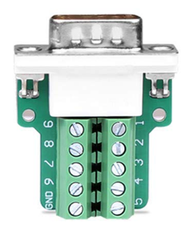
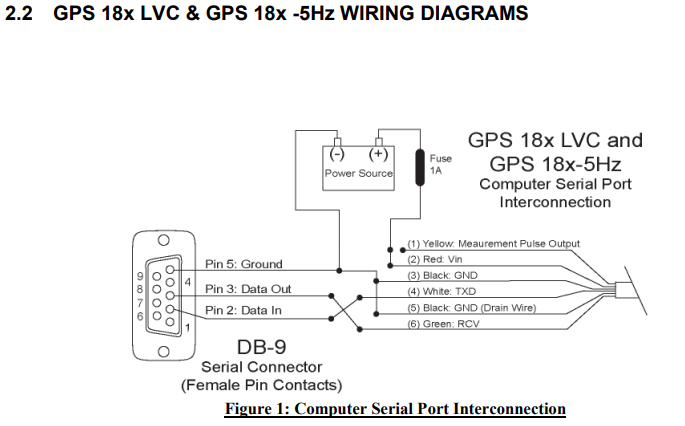

# NTP time with GPSD and PPS-enabled GPS GlobalSat MR-350P-S4
## Operating environment
- Ubuntu Bionic 18.04.3
- Linux kernel 5.4.3 (Vanilla kernel from kernel.org - no patches requried or used)

## Things you may need to buy
1. [Buy GlobalSat MR-350P-S4 on Amazon.com (US)](https://www.amazon.com/GlobalSat-Serial-Receiver-Mount-MR-350P-S4/dp/B00I3IQ780)
1. [Buy DB9 D-SUB RS232 Adapter (Female with Screw) on Amazon.com (US)](https://www.amazon.com/gp/product/B01C2WDU78)
1. [Buy PS/2 Mini-DIN Male-to-Female cable on Amazon.com (US)](https://www.amazon.com/gp/product/B007TZCTEE)
1. [Amazon search for DB9 D-SUB RS232 Adapter (Female with Screw)](https://www.amazon.com/s?k=DB9+D-SUB+RS232+Adapter+%28Female+with+Screw%29&i=electronics&ref=nb_sb_noss)
1. [Amazon search for PS/2 Mini-DIN Male-to-Female cable](https://www.amazon.com/s?k=PS%2F2+Mini-DIN+Male-to-Female+cable&i=electronics&ref=nb_sb_noss)
1. [Amazon search for GlobalSat MR-350P-S4](https://www.amazon.com/s?k=GlobalSat+MR-350P-S4&i=electronics&ref=nb_sb_noss)
1. [Buy Garmin 18x LVC GPS on Amazon.com (US)](https://www.amazon.com/gp/product/B0016O3T7A) - not required if you are using / buying the GlobalSat MR-350P-S4

## GlobalSat MR-350PS4 PS/2 pin-out


Pin | Function
--- | --------
1 | GND
2 | VCC
3 | PPS
4 | RX
5 | TX
6 | NC

## DB9 RS232 serial port pin-out


Pin | Function | Direction
--- | -------- | ---------
1 | DCD | Into computer from GPS
2 | RX | Into computer from GPS
3 | TX | To GPS from computer
4 | DTR | To GPS from computer (unused here)
5 | GND | -

## DB9 D-SUB RS232 Adapter (Female with Screw) screw pins


**Check the pin numbering at the screw terminals - may be different from this image !**

MR-350P-S4 PS/2 PIN | Function | DB9 PIN | USB cable wire
------------------- | -------- | ------- | --------------
1 | GND | 5 | Black
2 | VCC | - | Red
3 | PPS | 1 | -
4 | RX | 2 | -
5 | TX | 3 | -
6 | NC | - | -

Notes:
- PS/2 Pin 2 (VCC) goes ONLY to USB cable
- PS/2 Pin 1 (GND) goes to DB9 Pin 5 **AND** to USB cable

## Package installation
```apt install gpsd chrony setserial gpsd-clients pps-tools```
## Package versions

Package | Version
------- | -------
gpsd | 3.17-5
setserial | 2.17-50
pps-tools | 1.0.2-1
chrony | 3.2-4ubuntu4.2
gpsd-clients | 3.17-5

## Assumptions
This guide assumes GPS device is connected on SECOND serial port - ```ttyS1```
If this is not the case substitute ```/dev/ttyABC``` for ```/dev/ttyS1``` in following files
- var/lib/setserial/autoserial.conf
- etc/default/gpsd

**Do this before proceeding further**

## Configure serial port
- Strictly **NOT REQUIRED** just for testing PPS with gpsd. All setserial is used for is setting the serial port into **low_latency** mode - may improve PPS latency / accuracy
- Make sure you have modified ```var/lib/setserial/autoserial.conf``` to reflect serial port being used (if modification is required)
- Run ```dpkg-reconfigure setserial``` and set configuration mode to **MANUAL**
- Copy ```/lib/setserial/autoserial.conf``` to /var/lib/setserial/autoserial.conf
- ```for op in stop start; do systemctl $op setserial.service; done```

## Configure GPSD
- Make sure you have modified ```etc/default/gpsd``` to reflect serial port being used (if modification is required)
- Copy ```etc/default/gpsd``` to ```c/default/gpsd```

## Enable kernel PPS
### Check kernel config
```grep '^CONFIG_PPS' /boot/config-$(uname -r)```
Output should contain:
```
CONFIG_PPS=m
CONFIG_PPS_CLIENT_LDISC=m
```
### Enable loading of pps_ldisc modules on boot
- Copy ```etc/systemd/system/pps_ldisc.service``` to ```/etc/systemd/system```
- Run ```systemctl enable pps_ldisc.service```
- Technically this is not **REQUIRED** just to test GPSD, but if not using this service you need to do the following:
    - ```modprobe pps_ldisc``` before starting gpsd or restart gpsd after the modprobe
    - Do this after every reboot
    - Without module pps_ldisc, PPS capabilities will not be available

### Disable systemd-timesyncd.service
- systemd-timesyncd.service conflicts with chrony and if systemd-timesyncd.service is enabled, chrony will not autostart
- ```for op in stop disable mask; do systemctl $op systemd-timesyncd.service ; done```

### Setup chrony
- copy ```etc/chrony/chrony.conf``` to ```etc/chrony/```

## Testing
### Stop gpsd (systemd variant)
```systemctl stop gpsd.socket gpsd.service```

### Restart gpsd (systemd variant)
```for op in stop start; do systemctl $op gpsd.socket gpsd.service```

### Run gpsd in foreground for testing
- [Stop gpsd](README.md#stop-gpsd-systemd-variant)
- ```gpsd -b -n -N -D3 /dev/ttyS1 /dev/pps0``` (**IMPORTANT**: replace ``/dev/ttyS1``` with path to serial port you are using)

### Testing PPS capabilities
```ppswatch /dev/pps0```
### Testing GPS NMEA
1. ```cgps```
1. ```gpsmon```
### Showing chrony status
```
chronyc -m 'sources -v' tracking 'sourcestats -v'
```
PPS details highlighted in **BOLD**
### Sample chrony output
**```chronyc -m 'sources -v' tracking 'sourcestats -v'```**
```
210 Number of sources = 7

  .-- Source mode  '^' = server, '=' = peer, '#' = local clock.
 / .- Source state '*' = current synced, '+' = combined , '-' = not combined,
| /   '?' = unreachable, 'x' = time may be in error, '~' = time too variable.
||                                                 .- xxxx [ yyyy ] +/- zzzz
||      Reachability register (octal) -.           |  xxxx = adjusted offset,
||      Log2(Polling interval) --.      |          |  yyyy = measured offset,
||                                \     |          |  zzzz = estimated error.
||                                 |    |           \
MS Name/IP address         Stratum Poll Reach LastRx Last sample               
===============================================================================
#* PPS                           0   4   377    18  +1318ns[+2225ns] +/-  502us
^- 162.159.200.1                 3  10   377    56  +8603us[+8606us] +/-   46ms
^- time4.google.com              1  10   377   983  +1242us[+1189us] +/-   24ms
^- time-a-b.nist.gov             1  10   377   128  -2043us[-2039us] +/-   22ms
^- gpstime.la-archdiocese.n>     2  10   377   32m   +848us[ +667us] +/-   41ms
^- clock.fmt.he.net              1  10   377   209  -1836us[-1831us] +/- 4597us
^- clock.sjc.he.net              1  10   377    39   -507us[ -507us] +/- 3927us

210 Number of sources = 7
                             .- Number of sample points in measurement set.
                            /    .- Number of residual runs with same sign.
                           |    /    .- Length of measurement set (time).
                           |   |    /      .- Est. clock freq error (ppm).
                           |   |   |      /           .- Est. error in freq.
                           |   |   |     |           /         .- Est. offset.
                           |   |   |     |          |          |   On the -.
                           |   |   |     |          |          |   samples. \
                           |   |   |     |          |          |             |
Name/IP Address            NP  NR  Span  Frequency  Freq Skew  Offset  Std Dev
==============================================================================
PPS                        13   8   194     +0.001      0.062    +13ns  2834ns
162.159.200.1              10   8  155m     -0.431      0.820  +6442us  1354us
time4.google.com           14   7  223m     -0.400      0.509  -1817us  1802us
time-a-b.nist.gov          34  14  568m     -0.328      0.070  -1429us  1134us
gpstime.la-archdiocese.n>  20  12  327m     -0.342      0.123   -691us   799us
clock.fmt.he.net           17  10  276m     -0.429      0.198   -507us  1020us
clock.sjc.he.net           13   5  224m     -0.407      0.115   -933us   419us

Reference ID    : 50505300 (PPS)
Stratum         : 1
Ref time (UTC)  : Tue Dec 31 01:59:17 2019
System time     : 0.000000606 seconds fast of NTP time
Last offset     : +0.000000953 seconds
RMS offset      : 0.000001683 seconds
Frequency       : 25.250 ppm slow
Residual freq   : +0.001 ppm
Skew            : 0.068 ppm
Root delay      : 0.001000000 seconds
Root dispersion : 0.000021925 seconds
Update interval : 16.0 seconds
Leap status     : Normal
```

## Links
1. [GPSD Time Service HOWTO by author of GPSD](https://gpsd.gitlab.io/gpsd/gpsd-time-service-howto.html)
1.  [GPSD Compatible Hardware](https://gpsd.gitlab.io/gpsd/hardware.html)
1. [Troubleshooting by author of GPSD](https://gpsd.gitlab.io/gpsd/troubleshooting.html)
1.  [chrony with GPS for Time Synchronization](http://robotsforroboticists.com/chrony-gps-for-time-synchronization/)
1. [Not quite 5 minute guide to making an NTP Server](https://ava.upuaut.net/?p=726&cpage=2)
1. [Chrony and GPSD (Archlinux)](https://wiki.alpinelinux.org/wiki/Chrony_and_GPSD)
1. [Synchronizing ntpd to a Garmin GPS 18 LVC via gpsd](http://www.rjsystems.nl/en/2100-ntpd-garmin-gps-18-lvc-gpsd.php)
1. [GlobalSat MR-350PS4 Technical Specifications](https://www.gpscity.com/pdfs/manuals/MR350PS4-EN-MANUAL.pdf)
1. [RS232 Serial Cable Wiring](https://ltxfaq.custhelp.com/app/answers/detail/a_id/25/~/rs232-serial-cable-wiring)
1. [Crossover or "Null Modem" vs. Straight Through Serial Cable](https://www.decisivetactics.com/support/view?article=crossover-or-null-modem-vs-straight-through-serial-cable)
1. [Garmin 18x Technical Specifications](https://static.garmincdn.com/pumac/GPS_18x_Tech_Specs.pdf)

## Contents of files
### File list
```
.
├── etc
│   ├── chrony
│   │   └── chrony.conf
│   ├── default
│   │   └── gpsd
│   └── systemd
│       └── system
│           └── pps_ldisc.service
└── var
    └── lib
        └── setserial
            └── autoserial.conf

```
### etc/default/gpsd
**IMPORTANT** Change /dev/ttyS1 to path for serial port you are using
```
# Default settings for gpsd.
# Please do not edit this file directly - use `dpkg-reconfigure gpsd' to
# change the options.
START_DAEMON="true"
GPSD_OPTIONS="-b -n -D1"
DEVICES="/dev/ttyS1 /dev/pps0"
USBAUTO="false"
GPSD_SOCKET="/var/run/gpsd.sock"
```

### etc/systemd/system/pps_ldisc.service
```
[Unit]
Description=Modprobe pps_ldisc
After=setserial.service

[Service]
Type=oneshot
ExecStart=/sbin/modprobe pps_core
ExecStart=/sbin/modprobe pps_ldisc

[Install]
WantedBy=gpsd.service
```

### var/lib/setserial/autoserial.conf
**IMPORTANT** Change /dev/ttyS1 to path for serial port you are using
```
#
###AUTOSAVE-ONCE###
###AUTOSAVE-ONCE###
###AUTOSAVE###
#
# If you want to configure this file by hand, use 
# dpkg-reconfigure setserial
# and change the configuration mode of the file to MANUAL. If you do not do this, this file may be overwritten automatically the next time you upgrade the
# package.
#

# dpkg-reconfigure setserial   ...  set configuration mode to MANUAL
# Added next line for ttyS1 for Garmin 18 LVC GPS
# From: http://www.rjsystems.nl/en/2100-ntpd-garmin-gps-18-lvc-gpsd.php
# Only needed to add 'low_latency' to default port configuration
# Print out current port configuration:
#   setserial -G /dev/ttyS1
/dev/ttyS1 uart 16550A port 0x02f8 irq 3 baud_base 115200 spd_normal skip_test low_latency
```

### etc/chrony/chrony.conf
```
# This the default chrony.conf file for the Debian chrony package.  After
# editing this file use the command 'invoke-rc.d chrony restart' to make
# your changes take effect.  John Hasler <jhasler@debian.org> 1998-2008

# See www.pool.ntp.org for an explanation of these servers.  Please
# consider joining the project if possible.  If you can't or don't want to
# use these servers I suggest that you try your ISP's nameservers.  We mark
# the servers 'offline' so that chronyd won't try to connect when the link
# is down.  Scripts in /etc/ppp/ip-up.d and /etc/ppp/ip-down.d use chronyc
# commands to switch it on when a dialup link comes up and off when it goes
# down.  Code in /etc/init.d/chrony attempts to determine whether or not
# the link is up at boot time and set the online status accordingly.  If
# you have an always-on connection such as cable omit the 'offline'
# directive and chronyd will default to online.
#
# Note that if Chrony tries to go "online" and dns lookup of the servers
# fails they will be discarded.  Thus under some circumstances it is 
# better to use IP numbers than host names.

# ------------------------------------------------------------------------
# Use a local GPS device and gpsd as Staratum 0 GPS source
#
# Disable systemd-timesyncd.service - conflicts with chrony autostart !
#   for op in stop disable mask; do systemctl $op systemd-timesyncd.service ; done
#
#
# (20191229) Sundar: For Globalsat MR-350PS4 PPS GPS on SERIAL port
# From https://wiki.alpinelinux.org/wiki/Chrony_and_GPSD
# Commenting out NEMA and SOCK -:
#   - NEMA is too inaccurate and chrony will not use anyway!
#   - SOCK - does not seem to get any values !
#
#refclock SHM 0  delay 0.5 refid NEMA
refclock SHM 1 offset 0 delay 0.001 refid PPS
#refclock SOCK /var/run/chrony.ttyS1.sock delay 0.0 refid SOCK

# C(20180207) Setings for using USB non-PPS GPS device and GPSD
# NEMA is too inaccurate and chrony will not use anyway!
# Need to fiddle with offset (seconds) to make sure refclock is considered
# watch the output of 'chronyc sources' to see 'Last Sample'
#
# refclock SHM 0 offset 0.05 refid NMEA

server clock.fmt.he.net iburst
server clock.sjc.he.net iburst
server time.cloudflare.com iburst
server time.google.com iburst
server time.nist.gov
server gpstime.la-archdiocese.net

#server time1.google.com iburst
#server time2.google.com iburst
#server time3.google.com iburst
#server time4.google.com iburst
#pool 0.ubuntu.pool.ntp.org iburst
#pool 2.debian.pool.ntp.org offline iburst

# Specify IP address (interface) that chronyd CLIENT will bind to
# The bindacqaddress directive sets the network interface to which
# chronyd will bind its NTP client sockets
# bindacqaddress 0.0.0.0


# Allow other NTP clients in our zone to query time
# allow 10.3/16
# allow 10.30.0/24

# (CHANGED): chronyd version 3.2 commandkey directive is no longer supported
# This directive sets the key ID used for authenticating user commands via the
# 'chronyc' program at run time.
# commandkey 1

# End of customized settings - EXCEPT lines labeled with (CHANGED)
# ------------------------------------------------------------------------

# Look here for the admin password needed for chronyc.  The initial
# password is generated by a random process at install time.  You may
# change it if you wish.

keyfile /etc/chrony/chrony.keys

# I moved the driftfile to /var/lib/chrony to comply with the Debian
# filesystem standard.

driftfile /var/lib/chrony/chrony.drift

# Comment this line out to turn off logging.

log tracking measurements statistics
logdir /var/log/chrony

# Stop bad estimates upsetting machine clock.

maxupdateskew 100.0

# Dump measurements when daemon exits.

dumponexit

# Specify directory for dumping measurements.

dumpdir /var/lib/chrony

# This directive lets 'chronyd' to serve time even if unsynchronised to any
# NTP server.

#local stratum 10

# This directive designates subnets (or nodes) from which NTP clients are allowed
# to access to 'chronyd'.

#allow foo.example.net
#allow 10/8
#allow 0/0 (allow access by any IPv4 node)
#allow ::/0 (allow access by any IPv6 node)

# This directive forces `chronyd' to send a message to syslog if it
# makes a system clock adjustment larger than a threshold value in seconds.

logchange 0.5

# This directive defines an email address to which mail should be sent
# if chronyd applies a correction exceeding a particular threshold to the
# system clock.

# mailonchange root@localhost 0.5

# This directive tells 'chronyd' to parse the 'adjtime' file to find out if the
# real-time clock keeps local time or UTC. It overrides the 'rtconutc' directive.

hwclockfile /etc/adjtime

# This directive enables kernel synchronisation (every 11 minutes) of the
# real-time clock. Note that it can’t be used along with the 'rtcfile' directive.

rtcsync
```
# NTP time with GPSD and PPS-enabled GPS Garmin 18x LVC GPS
Note that you MUST buy the LVC version, and not the USB version(s).

Comparison with the GlobalSat MR-250P-S4:
- The Garmin 18x LVC seems to be considerably more expensive
- The Garmin 18x LVC is reviewed to **NOT** work indoors, while the GlobalSat MR-250P-S4 is reviewed to work indoors in wood buildings - see [GPSD Compatible Hardware](https://gpsd.gitlab.io/gpsd/hardware.html)

**NOTE: I have not personally tried the Garmin 18x LVC. I am only including this section in the hope that the wiring tips may help others who have or buy the Garmin 18x LVC**



The diagram above is from [Garmin 18x Technical Specifications](https://static.garmincdn.com/pumac/GPS_18x_Tech_Specs.pdf)

Garmin 18x LVC PIN (Color)| Function | DB9 PIN | USB cable wire
------------------- | -------- | ------- | --------------
1 | PPS (Yellow) | 1 | -
2 | VCC (Red) | - | Red
3 | GND (Black) | 5 | Black
4 | TX (White) | 3 | -
5 | GND (Black) | - | -
6 | RX (Green) | 2 | -
